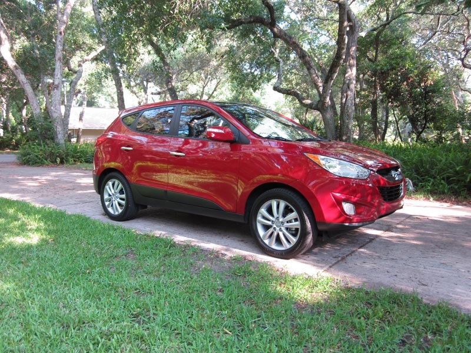

# Grab_AI_for_SEA
This project focusses on automatic car recognition which was build using pretrained models

## Table of contents
* [General info](#general-info)
* [Project Structure](#project_str)
* [Dataset](#data)
* [Project Execution Steps](#project)

<a name="general-info"></a>
## General info
The objective of this project is to develop a working model that can automatically identify cars given an image. It is targeted to serve as an automatic car recognition api.

The dataset used for this model was the [cars dataset](https://ai.stanford.edu/~jkrause/cars/car_dataset.html)

ResNet152 was used as a pretrained model which was further fine tuned for our custom image recognition engine.

The codes for the project is kept in the src folder and the common scripts are kept in the scripts folder.

Current validation accuracy for the cars dataset stands at 90% which can be further improved if trained for a larger period of time. Due to time constraints , further hyper-parameter optimisation for the network could not be done.

<a name="project_str"></a>
## Project Structure

The entire project structure is as follows:
```

├── custom_layers
│   └── scale_layer.py
├── data
│   ├── train (196 car folders containing images of training dataset)
│   └── valid [196 car folders containing images of validation dataset]
├── images
│   └── 01050.jpg
├── meta_info
│   ├── cars_meta.mat
│   └── cars_train_annos.mat
├── models
│   └── model.35-0.90.hdf5
├── pretrained
│   └── resnet152_weights_tf.h5
├── scripts
│   └── car_preprocessing.py
├── src
│   ├── resnet152.py
│   └── train_resnet.py
└── README.md
|__ tests

```
<a name="data"></a>
## Dataset

The dataset for this challenge was taken from [cars dataset](https://ai.stanford.edu/~jkrause/cars/car_dataset.html)

The Cars dataset contains 16,185 images of 196 classes of cars. The data is split into 8,144 training images and 8,041 testing images. As the GRAB AI challenge clearly stated just to take the training dataset for preparing the model , only the [training set](http://imagenet.stanford.edu/internal/car196/cars_train.tgz) containing 8144 inages were taken for training our model.
The [meta data](https://ai.stanford.edu/~jkrause/cars/car_devkit.tgz) was used to crop out the images.

<a name="project"></a>
## Project Execution Steps

These were the steps in brief taken to carry out the project

**1. Step 1: Downloading the dataset and Data preprocessing**

* The first step is to download the dataset from the [link](http://imagenet.stanford.edu/internal/car196/cars_train.tgz) ,extract it and and save it in the folder called 'cars_train'.

* We looked at some of the samples of the data and found that apart from the images of car, there were reduntant information like person , various background etc. One such example is shown in the figure below
<div style="text-align: center"></div>


* So we used the meta data provided in the dataset and preprocessed the data by cropping out the images using the bounding box information provided. After the images were cropped out it was saved accordingly to the corresponding train and valid folders inside the dataset directory. The script for the preprocessing the data is provided  in the 'scripts/car_preprocessing.py'[here]()

The script to run the preprocessing file is :

```
python scripts/car_preprocessing.py
```

This will save the files in 'data/train' and 'data/valid' folders.

**2. Step 2: Training the  model**

* So now after the data is ready, we used ResNet-152 pretrained model and fined tuned it for our custom car recognition.The ResNet-152 model can be downloaded from [here](https://drive.google.com/open?id=1GN82oE2vYrOUU3D0NdfMZ5dfzkGlkGYv). Please download the folder named 'pretrained' and save it in the project directory.

* Now we train the model using the script called 'train_resnet.py' which is inside the 'src' directory. The comand to run the script is as follows

```
python src/train_resnet.py
```

After running for 100 epochs , the model gets saved in 'models' directory. The validation accuracy stands at 90%.

* Since the model file size was large and was not being allowed to upload in git, so you can download the file from [here](https://drive.google.com/open?id=1WODMqBZEGqfuudpFrjiL_RzO06H8JggK) and save it in 'models' directory.


